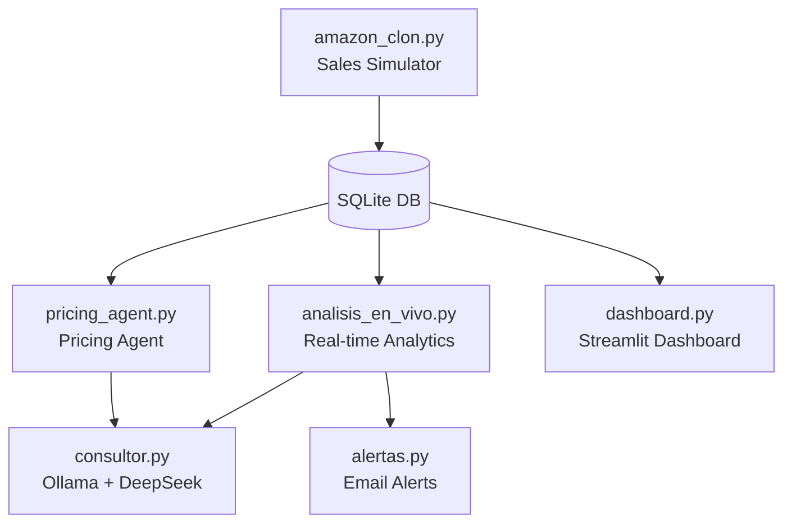
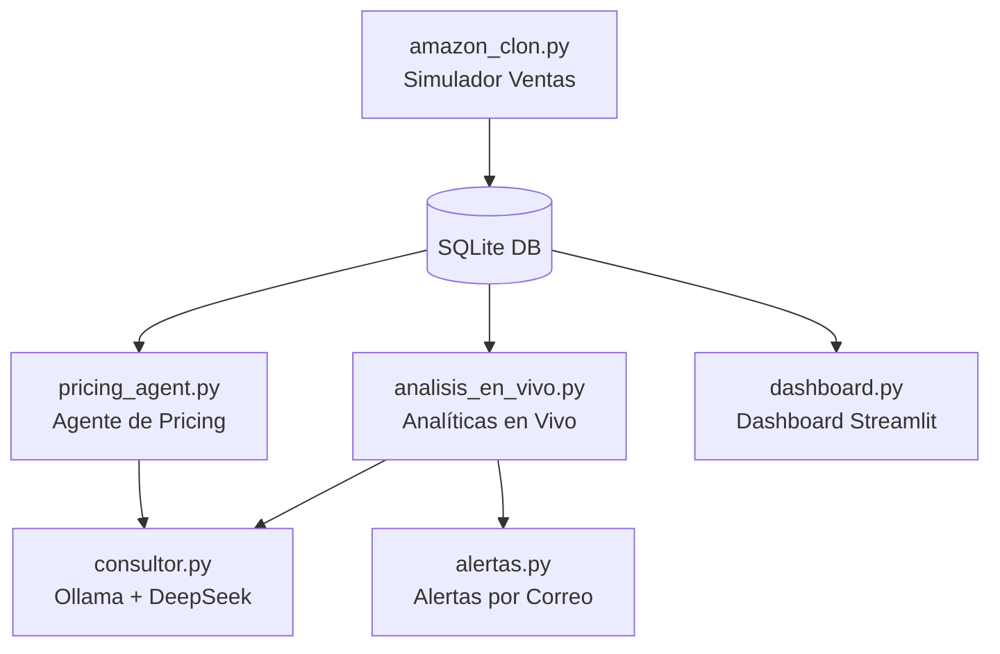

# 📦 Real-Time E-Commerce Analytics Engine with Local AI

This project simulates a live e-commerce production environment (Amazon style) that generates transactions in real time, stores them in SQLite, and uses a local Large Language Model (Llama 3.2 via Ollama) to analyze data, detect anomalies, suggest pricing strategies, and send automated email alerts — all without internet dependency for core operations.

## 🚀 System Architecture

The system is built as a **multi-agent architecture** with hybrid AI (local + cloud auditor):



### 📄 Project Files

| File | Role |
|---|---|
| `amazon_clon.py` | **Data Factory** — Generates +3,600 transactions/hour simulating real e-commerce (products, pricing, US locations, returns) |
| `analisis_en_vivo.py` | **Analytics Engine** — Runs every 5 min: top 5 products + gift returns analysis using local AI, audited by DeepSeek cloud |
| `pricing_agent.py` | **Pricing Agent** — Analyzes top 10 products by revenue and suggests price increases / discounts using local AI |
| `consultor.py` | **AI Connector** — Dual interface: `consultar_local()` (Ollama/Llama 3.2) and `auditar_respuesta()` (DeepSeek API) |
| `alertas.py` | **Email Alerts** — Sends SMTP alerts via Gmail when analytics detect anomalies or complete cycles |
| `dashboard.py` | **Streamlit Dashboard** — Visualizes top products with bar charts and allows Q&A with local AI |
| `instrucciones.md` | **Coding Rules** — Defines how the AI assistant teaches and collaborates with the developer |
| `tareas.md` | **Task Checklist** — Current and upcoming features to build |
| `linkedin_post.md` | **LinkedIn Post** — Draft post in English and Spanish about the project |


## 🛠️ Tech Stack

| Technology | Purpose |
|---|---|
| **Python 3.11+** | Core language |
| **SQLite** | Relational database (`amazon_clon.db`) |
| **Ollama + Llama 3.2 (3B)** | Local AI inference (zero API cost) |
| **DeepSeek API** | Cloud auditor — verifies local AI responses |
| **Streamlit** | Real-time dashboard |
| **SMTP (Gmail)** | Email alert delivery |
| **python-dotenv** | Environment variable management |
| **Git** | Version control with feature branch workflow |

## 💡 Key Insights & Data Optimization

* **Storage Efficiency:** ~3,600 sales/hour consume only ~1.8 MB over 8 hours in SQLite binary format.
* **Hallucination Mitigation:** All math (`SUM`, `AVG`, `COUNT`, `GROUP BY`) is computed in SQLite. The AI only receives pre-processed KPIs, eliminating arithmetic hallucinations.
* **Hybrid Architecture:** Llama 3.2 handles daily analysis locally; DeepSeek audits critical responses for quality control.
* **Proactive Alerts:** The system sends email notifications automatically — no need to watch dashboards.

## 🚀 Getting Started

```bash
# 1. Clone the repo
git clone https://github.com/MALopez200/amazon-realtime-analytics-ollama.git
cd amazon-realtime-analytics-ollama

# 2. Install dependencies
pip install -r requirements.txt

# 3. Configure environment
cp .env.example .env
# Add your DEEPSEEK_API_KEY and email credentials

# 4. Run the sales simulator (terminal 1)
python amazon_clon.py

# 5. Run the analytics engine (terminal 2)
python analisis_en_vivo.py

# 6. Run the dashboard (terminal 3)
streamlit run dashboard.py
```

## 📌 Requirements

```
ollama
openai
python-dotenv
streamlit
pandas
```

## 🔄 Git Workflow

- Feature branches: `feature/<name>`
- Multiple local commits before a single push
- One task per branch with descriptive commit messages

---

*Built with ❤️ by Miguel Ángel López S. — learning AI, data engineering, and clean code one commit at a time.*

<br/>

---

# 🇪🇸 Versión en Español

# 📦 Motor de Analytics en Tiempo Real con IA Local

Este proyecto simula un entorno de e-commerce en vivo (estilo Amazon) que genera transacciones en tiempo real, las almacena en SQLite y usa un modelo de Lenguaje Grande (LLM) local (Llama 3.2 vía Ollama) para analizar datos, detectar anomalías, sugerir estrategias de pricing y enviar alertas automáticas por correo — todo sin depender de internet para las operaciones principales.

## 🚀 Arquitectura del Sistema

El sistema está construido como una **arquitectura multi-agente** con IA híbrida (local + auditor cloud):



### 📄 Archivos del Proyecto

| Archivo | Rol |
|---|---|
| `amazon_clon.py` | **Fábrica de Datos** — Genera +3,600 transacciones/hora simulando e-commerce real (productos, precios, ubicaciones USA, devoluciones) |
| `analisis_en_vivo.py` | **Motor de Analítica** — Se ejecuta cada 5 min: top 5 productos + análisis de devoluciones de regalos con IA local, auditado por DeepSeek cloud |
| `pricing_agent.py` | **Agente de Pricing** — Analiza el top 10 de productos por ingresos y sugiere aumentos de precio / descuentos usando IA local |
| `consultor.py` | **Conector de IA** — Interfaz dual: `consultar_local()` (Ollama/Llama 3.2) y `auditar_respuesta()` (DeepSeek API) |
| `alertas.py` | **Alertas por Correo** — Envía alertas SMTP vía Gmail cuando la analítica detecta anomalías o completa ciclos |
| `dashboard.py` | **Dashboard Streamlit** — Visualiza top productos con gráficos de barras y permite preguntar a la IA local |
| `instrucciones.md` | **Reglas de Codificación** — Define cómo el asistente IA enseña y colabora con el desarrollador |
| `tareas.md` | **Lista de Tareas** — Funcionalidades actuales y próximas a construir |
| `linkedin_post.md` | **Post para LinkedIn** — Borrador en inglés y español sobre el proyecto |

## 🛠️ Stack Tecnológico

| Tecnología | Propósito |
|---|---|
| **Python 3.11+** | Lenguaje principal |
| **SQLite** | Base de datos relacional (`amazon_clon.db`) |
| **Ollama + Llama 3.2 (3B)** | Inferencia de IA local (costo CERO en API) |
| **DeepSeek API** | Auditor cloud — verifica respuestas de la IA local |
| **Streamlit** | Dashboard en tiempo real |
| **SMTP (Gmail)** | Envío de alertas por correo |
| **python-dotenv** | Gestión de variables de entorno |
| **Git** | Control de versiones con flujo de ramas por funcionalidad |

## 💡 Insights Clave y Optimización

* **Eficiencia de almacenamiento:** ~3,600 ventas/hora consumen solo ~1.8 MB en 8 horas en formato binario SQLite.
* **Mitigación de alucinaciones:** Todo el cálculo matemático (`SUM`, `AVG`, `COUNT`, `GROUP BY`) se ejecuta en SQLite. La IA solo recibe KPI pre-procesados, eliminando alucinaciones aritméticas.
* **Arquitectura híbrida:** Llama 3.2 maneja el análisis diario localmente; DeepSeek audita respuestas críticas para control de calidad.
* **Alertas proactivas:** El sistema envía notificaciones por correo automáticamente — sin necesidad de estar mirando dashboards.

## 🚀 Cómo Empezar

```bash
# 1. Clona el repositorio
git clone https://github.com/MALopez200/amazon-realtime-analytics-ollama.git
cd amazon-realtime-analytics-ollama

# 2. Instala dependencias
pip install -r requirements.txt

# 3. Configura el entorno
cp .env.example .env
# Agrega tu DEEPSEEK_API_KEY y credenciales de correo

# 4. Ejecuta el simulador de ventas (terminal 1)
python amazon_clon.py

# 5. Ejecuta el motor de analítica (terminal 2)
python analisis_en_vivo.py

# 6. Ejecuta el dashboard (terminal 3)
streamlit run dashboard.py
```

## 📌 Requisitos

```
ollama
openai
python-dotenv
streamlit
pandas
```

## 🔄 Flujo de Git

- Ramas por funcionalidad: `feature/<nombre>`
- Múltiples commits locales antes de un solo push
- Una tarea por rama con mensajes de commit descriptivos

---

*Construido con ❤️ por Miguel Ángel López S. — aprendiendo IA, ingeniería de datos y código limpio un commit a la vez.*
